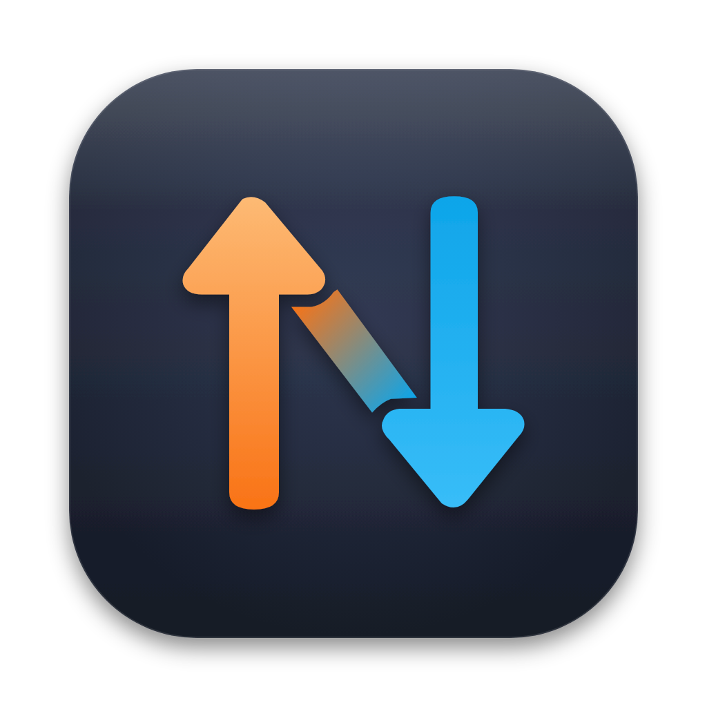

<p align="center">
  
</p>

<h1 align="center">NetSpeed</h1>

<p align="center">
  A tiny macOS menu-bar utility that displays current network download and upload speed.
</p>

Built for personal use on modern macOS.

## Display

```text
↓ 1.2 MB/s
↑ 84 kB/s
```

Traffic below 1 KiB/s is displayed as 1 kB/s when non-zero.

## Settings

Choose **Settings…** (⌘,) from the menu-bar item to configure:

- **Show download speed** / **Show upload speed**: show either line, or both. At least one always stays on.
- **Font size**: Small (9 pt), Medium (10 pt, default) or Large (11 pt).
- **Launch at login**: enabled automatically on first run; turn it off any time.

## Build

Requires Swift and macOS.

```sh
./build.sh
open NetSpeed.app
```

Launch-at-login registers the app's location, so for a stable login item build
and install to `/Applications`:

```sh
./build.sh --install
```

The app is ad-hoc signed. It is not notarized, so on first launch you may need
to right-click → **Open**.

## Project layout

```text
Sources/NetSpeed/          Swift sources
Resources/AppIcon.iconset  App icon at all macOS sizes (built into AppIcon.icns)
docs/branding/             Icon and GitHub social-preview artwork (SVG + PNG)
build.sh                   Builds, signs and optionally installs NetSpeed.app
LICENSE                    GNU General Public License v3.0
```

## App icon

The master artwork is `docs/branding/app-icon.svg`. The rendered icon set in
`Resources/AppIcon.iconset` is committed, and `build.sh` turns it into
`AppIcon.icns` with `iconutil`.

To change the icon, edit the SVG, export it as PNGs at the ten sizes macOS
expects (16, 32, 64, 128, 256, 512 and 1024 px, named `icon_16x16.png`,
`icon_16x16@2x.png`, and so on) into `Resources/AppIcon.iconset`, and rebuild.
Use a renderer with full SVG filter support, such as Chromium or Inkscape.

## Notes

Network traffic is measured from system interface byte counters and sampled once per second.

The project is intentionally minimal and has no external dependencies.

## License

NetSpeed is licensed under the GNU General Public License v3.0 or later. See
[LICENSE](LICENSE).

`NetworkCounterReader.swift` and `NetworkSampler.swift` are adapted from
[vorssaint/vorssaint-utils](https://github.com/vorssaint/vorssaint-utils), also
GPL-3.0-or-later. Their original copyright notices are kept in the file headers.
